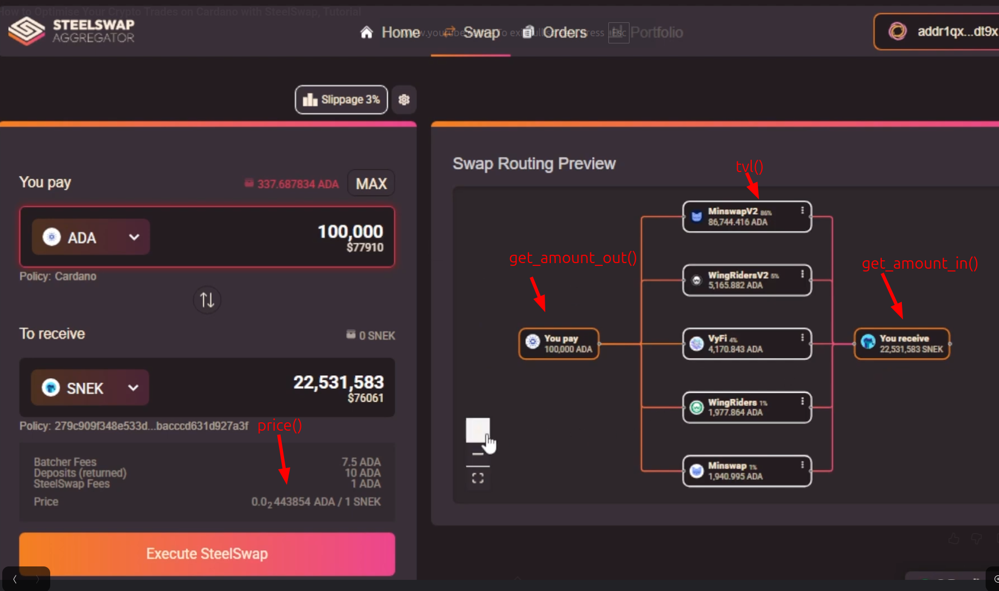

# Integrate Danogo Concentrated Liquidity Pool

## Inheritance

1. **`AbstractPairState`**: Abstract base class representing the state of a pair.
2. **`AbstractPoolState`**: Abstract class representing the state of a pool in an exchange.
3. **`ConcentratedPoolState`**: Concrete class implementing the logic for Danogo's Concentrated Liquidity Pool.

## `AbstractPairState`

### Properties

* **`swap_forward`**: Determine whether swap forwarding is enabled.
* **`inline_datum`**: Determine whether the datum should be inline.
* **`stake_address`**: The staking address.
* **`volume_fee`**: Swap fee of swap in basis points.
* **`unit_a`**: Token name of asset A.
* **`unit_b`**: Token name of asset B.
* **`reserve_a`**: Reserve amount of asset A.
* **`reserve_b`**: Reserve amount of asset B.
* **`price`**: Price of assets. A Tuple[Decimal, Decimal] where:
  * the first `Decimal` is the price to buy 1 of token B in units of token A
  * the second `Decimal` is the price to buy 1 of token A in units of token B.
* **`tvl`**: The total value locked for the pool.
* **`pool_id`**: A unique identifier for the pool or ob.

### Class Methods

* **`dex()`**: Official dex name.
* **`order_selector()`**: Order selection information.
* **`pool_selector()`**: Pool selection information.
* **`reference_utxo()`**: Get Reference UTXO.
* **`order_datum_class()`**: Returns data class used for handling order datums.
* **`default_script_class()`**: Get default script class as Plutus V1 unless overridden.
* **`cancel_redeemer()`**: the redeemer data for canceling transaction.
* **`dex_policy()`**: The dex nft policy. This should be the policy or policy+name of the dex nft.

### Instance Methods

* **`get_amount_out()`**: Calculate the output amount of assets for given input..
* **`get_amount_in()`**: Get the input asset amount given a desired output asset amount.
* **`script_class()`**: Returns the script class based on the Plutus version being used.
* **`swap_datum`**: Constructs the datum for a swap transaction.
* **`swap_utxo`**: Constructs the transaction output for a swap.
* **`batcher_fee`**: Batcher fee.
* **`deposit`**: Batcher fee.

## `AbstractPoolState`

Implements and overrides `AbstractPairState` members while adding pool-specific functionality.

### Properties {#pool-properties}

* **`pool_datum`**:The pool state datum.

### Class Methods {#pool-class-methods}

* **`pool_datum_class`**: The class type for the pool datum.
* **`pool_policy`**: The pool nft policies.
* **`lp_policy`**: The lp token policies.
* **`extract_dex_nft`**: Extract the dex nft from the UTXO.
* **`extract_pool_nft`**: Extract the pool nft from the UTXO.
* **`extract_lp_tokens`**: Extract the lp tokens from the UTXO.
* **`skip_init`**: An initial check to determine if parsing should be carried out.
* **`post_init`**: Post initialization checks.

### Instance Methods {#pool-instance-methods}

* **`translate_address`**: The main validation function called when initialized.

## `ConcentratedPoolState`

### `dex`

Returns the string `"Danogo Concentrated Liquidity"` as the unique DEX identifier.

### `pool_selector`

Returns a `PoolSelector` with hardcoded on-chain script addresses and pool NFT policy IDs used to locate Danogo Concentrated Liquidity pools.

### `pool_datum_class`

Returns `ConcentratedPoolDatum` — the datum class used to decode pool UTXO CBOR data.

### `pool_id`

Returns `self.pool_nft.unit()` — the pool NFT's asset unit string as the unique pool identifier.

### `extract_pool_nft`

Scans UTXO assets for tokens with quantity exactly `1`. Expects exactly one such NFT; raises `InvalidPoolError` otherwise. Removes the NFT from the asset map and stores it in `values["pool_nft"]`.

### `price`

1. Normalizes UTXO assets to natural units.
2. Computes active reserves by subtracting `platform_fee_x`, `total_swap_fee` from X and `platform_fee_y` from Y (clamped to 0).
3. Derives virtual reserves `(Xv, Yv)` via `calculate_xv_yv` using the datum's `sqrt_lower_price` / `sqrt_upper_price` bounds.
4. Returns `(Yv / Xv, Xv / Yv)` — price of B in A and price of A in B.

### `get_amount_out`

1. Resolves token X/Y units from the datum.
2. Computes active reserves (UTXO amounts minus admin fees, clamped to 0).
3. Calculates virtual reserves `(Xv, Yv)` for the current tick range.
4. Applies the constant-product AMM formula on virtual reserves with fee:
   `amount_out = floor( amount_in × fee_factor × res_out_virtual / (res_in_virtual × 10000 + amount_in × fee_factor) )`
5. Raises `ValueError` if the output would exceed actual active reserves.

### `get_amount_in`

1. Resolves token X/Y from the datum and determines swap direction from the desired output unit.
2. Computes active and virtual reserves identically to `get_amount_out`.
3. Applies the reverse AMM formula with ceiling division:
   `amount_in = ceil( virtual_res_in × amount_out × 10000 / ((virtual_res_out − amount_out) × fee_factor) )`
4. Raises `ValueError` if `amount_out` meets or exceeds either active or virtual reserves.

### `tvl`

* **ADA/Token pool**: `TVL = lovelace_in_utxo × 2 / 1_000_000` (assumes 50/50 split).
* **Token/Token pool**: `TVL = lovelace_in_utxo / 1_000_000` (returns min-ADA only; true value resolved externally by an aggregator).
